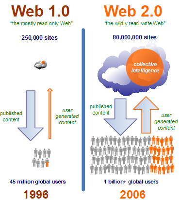
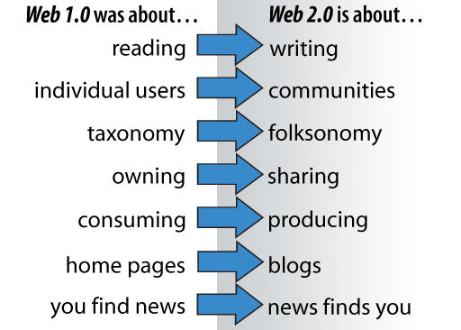
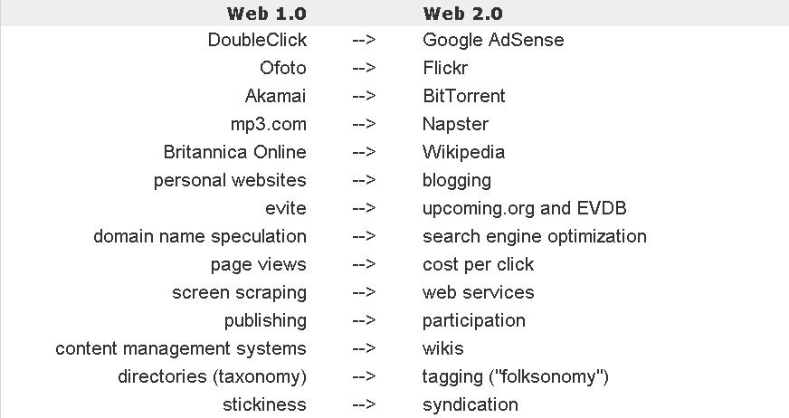

# Web Information Retrieval - WIR

>Information retrieval (IR) is the activity of obtaining information resources relevant to an information need from a collection of information resources.

WIR is Information Retrieval when the collection of information resources is the Web. The Web has unique chracteristics

1. is distributed and larger than traditional information resources 
2. is linked
3. is increasingly growing
4. information is semi-structured
5. multi-content (i.e. images, text etc) with different format and type of documents
6. the quality of documents is not homogeneous
7. the information changes rapidly

